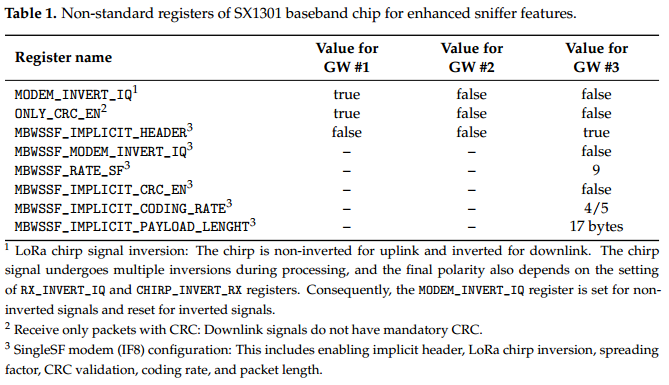

# LoRaWAN Traffic Analysis Tools

This repository contains the tools and materials used to obtain the dataset analyzed in the paper *Exploring LoRaWAN Traffic: In-Depth Analysis of IoT Network Communications*, available in 
.

The sniffer hardware comprises three IMST ic880A modules, connected to a Raspberry Pi along with a GPS and RTC. The signal path from the antenna includes a SAW filter, an LNA, and a four-way power splitter. The documentation for the motherboard hardware can be found in the `eagle` folder.

The Raspberry Pi mini-computer runs Raspberry Pi OS Lite. The ic880A modules connect via the SPI interface, the GPS through UART, and the RTC through I2C. Forks of the `lora_gateway` and `packet_forwarder` projects have been modified to support multiple SPI interfaces and the required sniffer functions (receiving packets with inverted IQ, no CRC, implicit header). Table 1 presents a list of the impacted SX1301 registers. A fork of the `ttybus` project provides GPS receiver hub support for all three instances of `packet_forwarder`, including correct GPS initialization. Configuration files and `systemd` scripts reside in the `packet_forwarder` repository.

Logs are stored on an SD card in JSON data format. For processing, we've developed a set of conversion tools to convert the raw JSON data recorded by the sniffer into the standard `pcap` format for Wireshark, using the [LoRaTap version 1](https://github.com/eriknl/LoRaTap) encapsulation implemented in recent Wireshark versions, which are available through the [automated build system](https://www.wireshark.org/download/automated/win64/) (choose 4.1.0rc0). The `pcap` data is then filtered, exported to `csv` format by the `tshark` tool, and post-processed using Python scripts. MATLAB scripts process the output data to provide graphical representations of statistics.

Therefore, the processing follows these steps:

* `01-compile.sh`: Compilation of conversion tools.
* `02-convert.sh`: Splitting the main log into individual datasets and converting to `pcap` format.
* `03-grep.sh`: Helper listings for specifying line numbers to split the log.
* `04-scan.sh`: Helper listings to determine line numbers to split the log.
* `05-count-packet.sh`: Statistics for individual packet types.
* `06-tshark-packet.sh`: Conversion to `csv` format and post-processing.
* `07-csv-devaddr.sh`: Assignment of network operators based on `DevAddr`.
* `08-csv-joinreq.sh`: Assignment of end device manufacturers based on `DevEUI`.
* `09-tshark-beacon.sh`: Class-B beacon analysis and processing of GPS data broadcast by the gateway.
* `run.m`: Generation of graphical statistics in MATLAB.
